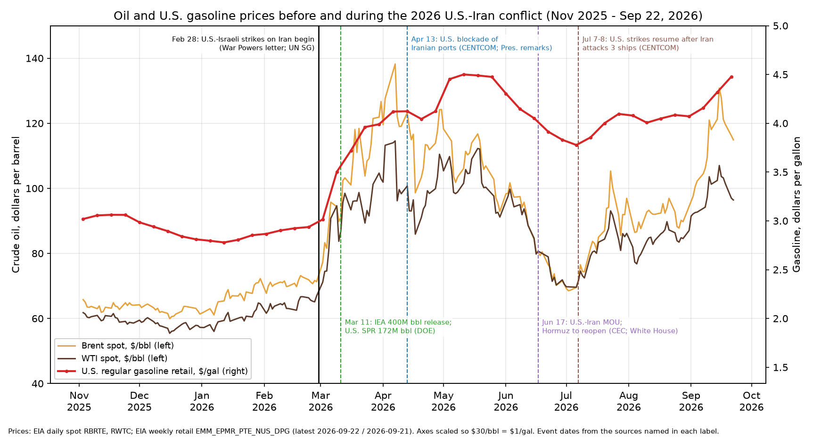

# Iran, the 2026 U.S.–Iran conflict, and fuel prices

*For the swampforce.com fuel-prices page. Prepared Sep 24, 2026 (MT). Proof is limited to official U.S. government, UN, EIA, IEA and OPEC records. Anything labeled **"reported, not confirmed by primary record"** came from news or secondary sources. Data: `iran-energy.csv`. Chart: `charts/iran-energy-prices-2026.png`.*

## Plain-English summary

- **The war began on Feb 28, 2026.** That day the U.S., together with Israel, began striking Iranian missile sites, maritime mining capabilities and air defenses. The President's War Powers letter lists keeping commerce flowing through the Strait of Hormuz among the goals.
- **The conflict has had three phases so far:**
  - A U.S. naval **blockade of Iranian ports** began Apr 13.
  - A **U.S.–Iran ceasefire and MOU** (Jun 17, per the CEC; announced by the White House Jun 19) was meant to reopen Hormuz.
  - **U.S. strikes resumed Jul 7–8** after Iran attacked three commercial ships (CENTCOM). The blockade of Iranian oil exports has since been renewed (EIA).
- **Prices before and since the war began:**
  - Brent rose from **$71.32** (Feb 27) to a peak of **$138.21** (Apr 7). It fell to **$68.53** (Jul 2) during the ceasefire and was **$114.89** on Sep 22.
  - U.S. regular gasoline rose from **$2.937** (Feb 23) to a peak of **$4.500** (May 11). It was **$4.478** on Sep 21, which is **$1.54 (52%) above pre-war**.
  - California gasoline rose from $4.441 to $6.003.
- **Why it matters (Hormuz):**
  - About **20 million b/d** passed through the Strait in 2024, roughly 20% of world oil consumption and more than a quarter of seaborne oil trade (EIA).
  - EIA estimates Middle East crude shut-ins averaged **9.4 million b/d in Mar–Jun 2026** and were **6.7 million b/d in Aug**.
  - The IEA says Gulf oil exports in August were about 13 mb/d, **nearly half their pre-war level**, and that global inventories have fallen about 507 million barrels since February.
- **Iran's own oil output has fallen:**
  - OPEC secondary sources: about 3.26 mb/d (2025 average) to about 2.48 mb/d (Jul 2026).
  - EIA: crude production of 3.38 mb/d in 2025, 2.85 mb/d in 2Q26.
  - IEA: Iran supplied 2.16 mb/d in August.
- **China is essentially Iran's only customer.** EIA's June 2026 report to Congress under the SHIP Act puts 99% of Iran's 2025 crude and condensate exports (1.58 mb/d) as going to China, and puts Iran's undiscounted crude revenue at about $48B in 2025.
- **Who controls Iran's oil (U.S. Treasury findings):**
  - The **Supreme Leader** commands the armed forces, including the **IRGC**.
  - The **National Iranian Oil Company (NIOC)**, overseen by the **Ministry of Petroleum**, runs production and exports. Treasury designated the Ministry, NIOC and the tanker company NITC in 2020 for supporting the IRGC-Qods Force.
  - The IRGC runs its own oil-sales network (Treasury, May 2026).
  - Treasury now refers to **Mojtaba Khamenei** as "Iran's leader."
- **The U.S. government response has included:**
  - A **172-million-barrel SPR release** as part of a 400M-bbl IEA collective action.
  - The naval blockade.
  - Waves of **OFAC sanctions**, including "Operation Economic Outcast" on Aug 24.
  - A DOJ/FTC letter to states about pump prices.
- The SPR has fallen from 415.4M to **284.6M barrels**, its lowest level since late 1982.

## 1. Timeline, from official sources
| Date | Event | Primary source |
|---|---|---|
| Feb 28, 2026 | U.S. strikes on Iran begin (with Israel): missile sites, maritime mining capabilities, air defenses. Stated objectives include "free flow of maritime commerce through the Strait of Hormuz" | [War Powers letter, Mar 2, 2026 (H. Doc. 119-139)](https://www.govinfo.gov/content/pkg/CDOC-119hdoc139/pdf/CDOC-119hdoc139.pdf) |
| Feb 28, 2026 | UN Secretary-General condemns the strikes and Iran's retaliatory attacks on Gulf/Arab states. He notes reports that Iran was closing Hormuz and says he cannot confirm reports of Ayatollah Ali Khamenei's death | [UN SG/SM/23033](https://press.un.org/en/2026/sgsm23033.doc.htm) |
| Mar 11, 2026 | IEA members agree to a 400M-bbl emergency release; U.S. commits 172M bbl from the SPR | [DOE](https://www.energy.gov/articles/united-states-release-172-million-barrels-oil-strategic-petroleum-reserve) |
| Mar 13, 2026 | DOE requests proposals for an 86M-bbl SPR emergency exchange, with barrels returned at a premium | [DOE](https://www.energy.gov/articles/energy-department-initiates-strategic-petroleum-reserve-emergency-exchange-stabilize) |
| Mar 17, 2026 | Department of Homeland Security issues a Jones Act waiver for domestic port-to-port fuel shipments (per the California Energy Commission; I did not locate the DHS document itself) | [CEC FAQ](https://www.energy.ca.gov/programs-and-topics/topics/petroleum-fuels-transition/faq-california-gas-prices-and-impacts-iran) |
| Apr 12–13, 2026 | President says the ceasefire is holding and a blockade will start so "Iran will not be able to sell oil." CENTCOM blockade of all traffic entering or exiting Iranian ports begins Apr 13, 10 a.m. ET; ships transiting Hormuz to and from non-Iranian ports are not blocked | [Presidential remarks (DCPD-202600248)](https://www.govinfo.gov/content/pkg/DCPD-202600248/pdf/DCPD-202600248.pdf); [CENTCOM release, mirrored by U.S. Mission China](https://cn.usembassy.gov/u-s-to-blockade-ships-entering-or-exiting-iranian-ports/) |
| May 11, 2026 | Treasury designates 12 targets tied to the IRGC's oil sales to China, warns Chinese "teapot" refiners of secondary sanctions, and refers to sales "through the blockade" | [Treasury sb0498](https://home.treasury.gov/news/press-releases/sb0498) |
| Jun 17, 2026 | Ceasefire agreement with conditions to reopen Hormuz (CEC timeline). The White House's Jun 19 release says the President and Vice President signed a Memorandum of Understanding with Iran that "reopens the Strait of Hormuz"; the "60-day" length appears in statements quoted on that page | [White House, Jun 19](https://www.whitehouse.gov/releases/2026/06/president-trumps-iran-agreement-is-america-first-in-action/); [CEC FAQ](https://www.energy.ca.gov/programs-and-topics/topics/petroleum-fuels-transition/faq-california-gas-prices-and-impacts-iran) |
| Jul 7–8, 2026 | CENTCOM strikes about 80 targets (Jul 7), including more than 60 IRGC small boats, and about 90 targets (Jul 8), after Iran attacked three commercial vessels in Hormuz, which CENTCOM calls a violation of the ceasefire | [CENTCOM, Jul 8](https://www.centcom.mil/MEDIA/PUBLIC-RELEASES/Article/4538814/us-forces-complete-another-round-of-strikes-against-iran/) |
| Jul 10, 2026 | Treasury cites "Iran's resumption of attacks on international shipping," calls Mojtaba Khamenei "Iran's leader," and designates financier Ali Ansari | [Treasury sb0558](https://home.treasury.gov/news/press-releases/sb0558) |
| Aug 24, 2026 | Treasury's "Operation Economic Outcast": about 60 designations, new sector determinations under EO 13902, and shadow-fleet tankers carrying Iranian oil to China | [Treasury sb0613](https://home.treasury.gov/news/press-releases/sb0613) |
| Sep 2026 | EIA says the U.S. blockade on Iranian oil exports has been renewed | [EIA STEO, Sep 2026](https://www.eia.gov/outlooks/steo/) |

**Reported, not confirmed by primary record:**
- The operation name "Operation Epic Fury" appears on the White House's Jun 19 release, but only inside a quoted lawmaker statement. war.gov pages returned HTTP 403 to automated fetches, so I could not confirm the name from DoD.
- Ali Khamenei's death on Feb 28, and the Assembly of Experts selecting Mojtaba Khamenei around Mar 8–9. The official U.S. record does confirm Treasury now treats Mojtaba as leader.
- A U.S. strike on Jun 26 after a ship attack, and President Pezeshkian signing the MOU.
- An IEA figure of 7.6 mb/d Hormuz flow in August (seen in a search summary, but not on the IEA page I opened).

## 2. Prices before and since the war (EIA)
Sources: [Brent daily](https://www.eia.gov/dnav/pet/hist/LeafHandler.ashx?n=PET&s=RBRTE&f=D), [WTI daily](https://www.eia.gov/dnav/pet/hist/LeafHandler.ashx?n=PET&s=RWTC&f=D), [U.S. regular gasoline weekly](https://www.eia.gov/dnav/pet/hist/LeafHandler.ashx?n=PET&s=EMM_EPMR_PTE_NUS_DPG&f=W), [California gasoline weekly](https://www.eia.gov/dnav/pet/hist/LeafHandler.ashx?n=PET&s=EMM_EPMR_PTE_SCA_DPG&f=W).

| Point | Brent $/bbl | WTI $/bbl | U.S. gas $/gal | CA gas $/gal |
|---|---|---|---|---|
| Last pre-war reading (Feb 27 crude / Feb 23 gas) | 71.32 | 66.96 | 2.937 | 4.441 |
| Peak since war | 138.21 (Apr 7) | 114.58 (Apr 7) | 4.500 (May 11) | — |
| Ceasefire low | 68.53 (Jul 2) | — | 3.777 (Jul 6) | — |
| Latest (Sep 22 crude / Sep 21 gas) | **114.89** | **96.41** | **4.478** | **6.003** |
| Change, pre-war → latest | +43.57 (+61%) | +29.45 (+44%) | +1.541 (+52%) | +1.562 (+35%) |

Average by phase (my averages of EIA daily and weekly data):

| Phase | Brent | WTI | U.S. gas |
|---|---|---|---|
| Pre-war (Jan 1 – Feb 27) | 68.69 | 62.22 | 2.858 |
| War to blockade (Feb 28 – Apr 12) | 107.66 | 94.77 | 3.718 |
| Blockade of Iranian ports (Apr 13 – Jun 16) | 105.87 | 98.28 | 4.271 |
| MOU / ceasefire (Jun 17 – Jul 6) | 73.31 | 73.37 | 3.841 |
| Renewed strikes (Jul 7 – Sep 22) | 95.99 | 87.26 | 4.109 |

EIA's [Sep 2026 STEO](https://www.eia.gov/outlooks/steo/) ([PDF](https://www.eia.gov/outlooks/steo/pdf/steo_full.pdf)) says:
- Brent averaged $91 in August.
- Forecast: about $90 for the rest of 2026, $91 for all of 2026, and $74 for 2027.
- Retail gasoline forecast: $3.84 average for 2026 and $3.35 for 2027.

## 3. Strait of Hormuz
| Measure | Value | Source |
|---|---|---|
| Oil flow through Hormuz, 2024 | 20 mb/d (about 20% of global liquids consumption; more than 1/4 of seaborne oil trade) | [EIA Today in Energy, Jun 16, 2025](https://www.eia.gov/todayinenergy/detail.php?id=65504) |
| Share of Hormuz crude going to Asia | 84% (China, India, Japan and South Korea took 69% of all Hormuz flows) | same |
| Bypass pipeline capacity (Saudi Arabia, UAE) available | about 2.6 mb/d | same |
| U.S. imports via Hormuz, 2024 | about 0.5 mb/d (about 7% of U.S. crude imports) | same |
| Middle East crude shut-ins, EIA estimate | Mar–Jun avg 9.435 mb/d; Jul 4.98; Aug 6.72; 4Q26 forecast 5.66; 1Q27 2.72 | [EIA STEO Sep 2026, Table 1](https://www.eia.gov/outlooks/steo/pdf/steo_full.pdf) |
| Gulf oil exports, Aug 2026 | about 13 mb/d, "nearly half" pre-war | [IEA OMR Sep 2026](https://www.iea.org/reports/oil-market-report-september-2026) |
| Global observed inventory draw since February | 507M bbl (IEA); EIA estimates about 400M bbl | IEA OMR; EIA STEO |
| Share of California crude imports via Hormuz | about 17% | [CEC FAQ](https://www.energy.ca.gov/programs-and-topics/topics/petroleum-fuels-transition/faq-california-gas-prices-and-impacts-iran) |

EIA's interactive "World Oil Transit Chokepoints" page is a JavaScript app, so I cited EIA's Jun 2025 Today in Energy chokepoint analysis for the same figures.

## 4. Iran's oil production and exports
| Measure | Value | Source |
|---|---|---|
| Crude production (EIA) | 2025: 3.38 mb/d; 1Q26: 3.35; 2Q26: 2.85; Feb 2026: 3.39 | [EIA STEO Sep 2026](https://www.eia.gov/outlooks/steo/pdf/steo_full.pdf) |
| Iran shut-ins (EIA estimate) | Mar–Jun avg 0.455 mb/d; Jul 0.20; Aug 1.00 | same |
| Crude production (OPEC secondary sources), thousand b/d | 2025: 3,263; 1Q26: 3,142; 2Q26: 2,532; May: 2,278; Jun: 2,451; Jul: 2,478 | [OPEC MOMR Aug 2026](https://www.opec.org/assets/assetdb/momr-august-2026.pdf) |
| Crude supply (IEA) | Jul 2026: 2.72 mb/d; Aug: 2.16; sustainable capacity 3.8 | [IEA OMR Sep 2026](https://www.iea.org/reports/oil-market-report-september-2026) |

- Reported, not confirmed: an OPEC August figure of about 2.09 mb/d. I could not open the Sep MOMR.
- EIA, OPEC and IEA use different definitions and sources, so their numbers differ.

**Exports and buyers.** Source: [EIA SHIP Act report to Congress, Jun 2026](https://www.eia.gov/international/content/analysis/special_topics/SHIP_Act/SHIP-Act.pdf). EIA uses Vortexa tanker-tracking estimates. The "to China" figures include cargoes EIA assesses as China-bound.

| Year | Crude & condensate exports (kb/d) | To China (kb/d) | Undiscounted revenue ($B) |
|---|---|---|---|
| 2018 | 1,976 | 609 | 51 |
| 2019 | 651 | 315 | 11 |
| 2020 | 343 | 287 | 5 |
| 2021 | 808 | 658 | 19 |
| 2022 | 923 | 757 | 38 |
| 2023 | 1,276 | 1,124 | 43 |
| 2024 | 1,445 | 1,384 | 49 |
| 2025 | 1,576 | 1,567 (99%) | 48 |

- EIA notes Iranian Light traded at an $8–10/bbl discount to Brent in Jan 2026, citing trade press.
- EIA's [Iran country analysis](https://www.eia.gov/international/analysis/country/IRN) said China took about 90% in 2023.
- Treasury's 2026 designations (sb0498, sb0613) likewise describe Iranian oil flowing to Chinese independent ("teapot") refiners through front companies and shadow-fleet tankers.
- **I found no primary-record figure for Iran's export volumes since the Apr 13 blockade.**

## 5. Who controls Iran's oil sector and government (official U.S. and UN records)
- **Supreme Leader:**
  - Per [Treasury sm824 (Nov 4, 2019)](https://home.treasury.gov/news/press-releases/sm824), the Supreme Leader is commander-in-chief of the armed forces and appoints the head of the Armed Forces General Staff, which oversees the IRGC.
  - The same 2019 action designated Mojtaba Khamenei.
  - In [Treasury sb0558 (Jul 10, 2026)](https://home.treasury.gov/news/press-releases/sb0558), Treasury calls Mojtaba Khamenei "Iran's leader" and the "so-called Supreme Leader."
  - The UN SG on Feb 28 said he could not confirm Ali Khamenei's death.
- **IRGC:** designated a Foreign Terrorist Organization (April 2019) and under EO 13224 (2017), per Treasury sm824.
  - It runs its own oil-marketing network. [Treasury sb0498 (May 11, 2026)](https://home.treasury.gov/news/press-releases/sb0498) targets the **IRGC's Shahid Purja'fari Oil Headquarters**, which sells oil to China through front companies.
- **National Iranian Oil Company (NIOC):**
  - Per [Treasury sm1165 (Oct 26, 2020)](https://home.treasury.gov/news/press-releases/sm1165), NIOC is overseen by the **Ministry of Petroleum** and handles exploration, production, refining and export.
  - **NITC** is its tanker arm.
  - The Ministry, NIOC and NITC were designated under counterterrorism authority EO 13224 for financially supporting the IRGC-Qods Force.

## 6. U.S. sanctions status (Treasury OFAC)
- Iran's oil sector remains under comprehensive U.S. sanctions:
  - The Ministry of Petroleum, NIOC and NITC are designated under EO 13224 (sm1165).
  - The IRGC is a designated FTO.
- 2026 escalation:
  - **May 11:** 12 designations tied to IRGC oil sales, plus a warning of secondary sanctions on Chinese teapot refiners (sb0498).
  - **Jul 10:** financier designations (sb0558).
  - **Aug 24:** "Operation Economic Outcast," with about 60 designations, five new sector determinations under EO 13902, and shadow-fleet tankers (sb0613).
- The physical **naval blockade** of Iranian ports (from Apr 13) remains in place, and EIA says it has been renewed.
- The June MOU text was not published in a primary record I could find. The White House summary does not describe any sanctions relief.

## 7. SPR and other U.S. responses (DOE, EIA)
| Measure | Value | Source |
|---|---|---|
| SPR release committed (IEA collective action) | 172M bbl | [DOE, Mar 11](https://www.energy.gov/articles/united-states-release-172-million-barrels-oil-strategic-petroleum-reserve) |
| First exchange tranche offered | 86M bbl | [DOE, Mar 13](https://www.energy.gov/articles/energy-department-initiates-strategic-petroleum-reserve-emergency-exchange-stabilize) |
| SPR stocks, Feb 27, 2026 | 415.441M bbl | [EIA WCSSTUS1](https://www.eia.gov/dnav/pet/hist/LeafHandler.ashx?n=PET&s=WCSSTUS1&f=W) |
| SPR stocks, Sep 18, 2026 | **284.552M bbl** (lowest since late 1982) | same |
| Drawdown since war began | 130.9M bbl | computed |
| U.S. crude exports, weekly avg since war vs Dec 2025–Feb 2026 | 4,283 vs 4,097 kb/d | EIA weekly |
| U.S. total product exports, same comparison | 7,736 vs 7,044 kb/d | EIA weekly |

Other official responses:
- DHS Jones Act waiver, Mar 17 (per CEC).
- DOJ/FTC letter to state attorneys general on pump prices, Jul 3 ([DOJ/FTC](https://www.justice.gov/atr/media/1450951/dl?inline=)). It is a warning and a call for state investigations, not a finding.
- California's enforcement bulletin and station inquiry ([CEC DPMO, Jun 12](https://www.energy.ca.gov/sites/default/files/2026-06/DPMO_California_Gasoline_Diesel_Market_Update_June_2026_ada.pdf)).

## Files
- `iran-energy.csv`: all figures and timeline entries, with source URLs.
- `charts/iran-energy-prices-2026.png`: Brent, WTI and U.S. gasoline from Nov 2025 to Sep 2026, with the war start (Feb 28) and key events marked.
- `build_iran.py`: rebuilds the CSV and chart from the raw EIA files in `raw/`.
